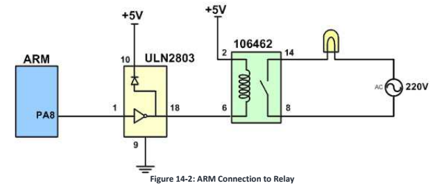
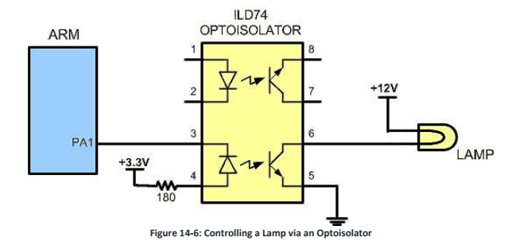
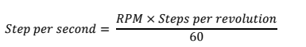
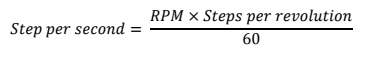

# Chapter 14: Relay, Optoisolator, Stepper Motor Interfacing

## Relay and Optoisolator

### Electromechanical Relay

a _relay_ is an electrically controllable switch widely used in industrial controls. It allows the isolation of two separation sections of a system with two differrent voltage sources.

For exampe, a 5V system can be isoltaed from a 120V system by placing a relay between them. 

- Electromechanical relay (EMR) have coil, sping and contacts.

### Driving a relay

Relay's need around 10 to 50 mA. The STM32 can provide max 25 mA current. For this reason we place a driver ULN2803 or a transistor between the microcontroller and the relay.



```c

/* Toggles PA8 every second and the lamp turns on and off */

int main()
{
    RCC->APB2ENR |= 0xFC; /* ena GPIO port clocks */
    GPIOA->CRH = 0x44444443; /* PA8 as output */

    while(1)
    {
        GPIO->ODR ^= (1>>8) /* toggle PA8 */
        delay_ms(1000)
    }
}
```
### Solid State Relay 

The entire relay is made out of semiconductor materials. Their switching response time is much faster than ERC. 

SSR is its greater life expectrancy.

### Optoisolator

Optoisolator or Optocoupler are used to isolate two parts of a system. Motors can produce back EMD, a high voltage spoke produced by sudden change of current as indicated in the formula V = Ldi/dt. In some apps we can reduce this effect called ground bounce by using decoupling capacitors.

In systens that have inductors such a motors, a decoupling capacitor or a diode will not do the job. In these case we use a Optoisolator. 

Optoisoators are also widely used in communication equipment such as modems. This device allows a computer to be conncted to a telephone line without risk of damage from high voltage of telephone line. 



## Stepper Motor Interfacing

Stepper motor is a device that translates electrical pulses into mechanical movement. 

1. Use an ohmmeter to measure the resistance of the leads. This should identify wich CO leads are connected to wich winding leads.
2. The comon wires are connected to the positive side of the motors. In many motors, 5V is sufficient.
3. The four leads of the stator winding are controlled by four bits of the ARM port PA0-PA3 because the microcontroller lacks sufficient current to drive the stepper motor windings, we must use a driver as the UNL2003 or UNL2803 to energize the stator. 

#### Steps per second and RPM



```c

#### Step Angle

How much movement is associated with a single step? Depends on the internal construction of the motor.

Relation Step Angle / Step per revolution

  

#### Motor Speed

- Measured in setps/s is a function of the switching rate 

### Controlling a Stepper motor via Optoisolator

```c
/* The program monitors PB0. It rotates clockwise if it is high. Otherwise, it rotates counter clockwise */

#include <stm43f10x.h>

int main()
{
    const uint8_t steps[4] = {0x09, 0x0C, 0x06, 0x03}; /* Table 14-3 */
    RCC->APB2ENR |= 0xFC; /* Enable GPIO ports clocks */
    
    GPIOA->CRL = 0x44443333; /* PA0-PA3 as outputs */
    GPIOB->CRL = 0x44444448; /* PB0 as input with pull-up */
    GPIOB->ODR |= (1<<0); /* pull-up PB0 */

    uint8_t n = 0;
    while(1)
    {
        GPIOA->ODR = steps[n]; /* go to next step */

        if((GPIOB->IDR & (1<<0)) != 0) /* is PB0 high */
        {
            if(n>=3)
                n=0;
            else 
                n++;
        }
        else
        {
            if(n==0)
                n = 3;
            else 
                n--; /* counter clockwise */
        }

        delay_ms(100); /* wait 100 ms */
    }
}


```