# Chapter 15: PWM and DC Motor Control

## DC Motor Interfacing and PWM

### DC Motors

- DC motors is a device athat translates electrical currentr into mechanical movement
- We have only + and - leads.
- Connecting them to a DC voltage source moves the motor in one direction.
- By reversing the polarity the DDC motor will rotate in the oposite direction.
- Maximun speed of a DC motor is indicated in RPM given in the data sheet.
  - RPM no-load (in datahseet): a few thousand to tens o f thousands.
- Nominal voltage depending on the motor (1 to 150 V)
- Consumption: when nominal voltage is applied with no load (25 mA to a few amps. As the load increases, RMP is decreased.
- With a fixed voltage, as the load increases the current consumption of a DC motor is increased.
- If we overload the motor it will stall and that ca damage the motor due to the heat generated by high current consumption.

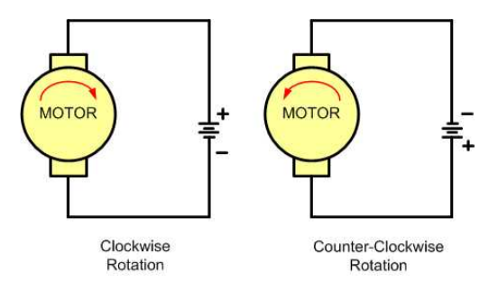  

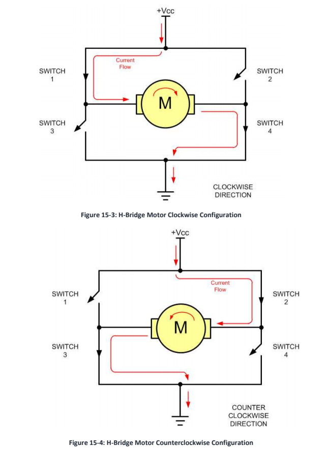  

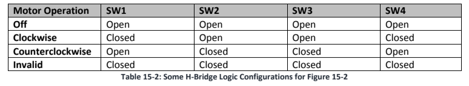  

```c 

int main (void)
{
    void delayMs(int n);
    PORTD->PCR[0] = 0x100; /* make PTD0 pin as GPIO */
    PORTD->PCR[1] = 0x100; /* make PTD1 pin as GPIO */
    PORTD->PCR[2] = 0x100; /* make PTD2 pin as GPIO */
    PORTD->PCR[3] = 0x100; /* make PTD3 pin as GPIO */
    PORTD->PCR[7] = 0x103; /* make PTD7 pin as GPIO and enable pull-up */
    PTD->PDDR |= 0x0F; /* make PTD0-3 as output pin */
    PTD->PDDR &= ~0x80; /* make PTD7 as input pin */

    if((PTD->PDIR & 0x80) == 0) /* PTD7 == 0 */
    {
        PTD->PDOR &= ~0x0F; /* open  all switches */
        delayMs(100); /* wait 0.1 s */
        PTD->PDOR |= 0x09; /* close SW1 & SW4 */

        while((PTD->PDIR & 0x80) == 0); /* PTD7==0 */
    }
    else
    {
        /* PTD7 ==1 */
        PTD->PDOR &= ~0x0F; /* Open all switches */
        delayMs(100);
        PTD->PDOR |= 0x06; /* close SW2 & SW3 */
        while((PTD->PDIR & 0x80) != 0); /* PTD7 == 0 */
    }    
}
```

```c
/* Solution using SPTD Relays */
int main (void)
{
    PORTD->PCR[0] = 0x100; /* make PTD0 pin as GPIO */
    PORTD->PCR[1] = 0x100; /* make PTD1 pin as GPIO */
    PORTD->PCR[7] = 0x103; /* make PTD7 pin as GPIO and ENABLE pull-up */
    PTD->PDDR |= 0x03;     /* make PTD0-1 as output pin */
    PTD->PDDR &= ~0x80;    /* make PTD7 as input pin */
    
    if((PTD->PDIR & 0x80) == 0)
    { /* PTD7 == 0 */
        PTD->PDOR &= ~0x02; /* relay 2 = Off */
        PTD->PDOR |= ~0x01; /* relay 1 = On  */
    }
    else
    { /* PTD7 == 0 */
        PTD->PDOR &= ~0x01; /* relay 1 = Off */
        PTD->PDOR |= ~0x02; /* relay 2 = On  */
    }
}
```

### Pulse width modulation (PWM)

- Speed of motor depends on three factors
  - load
  - voltage
  - current
- For a given fixed load we can mantain a steady speed using a method called PWM.
  - By modulating the width of the pulse applied to the DC motor we can increase or decrease de amount of power provided to the motor.

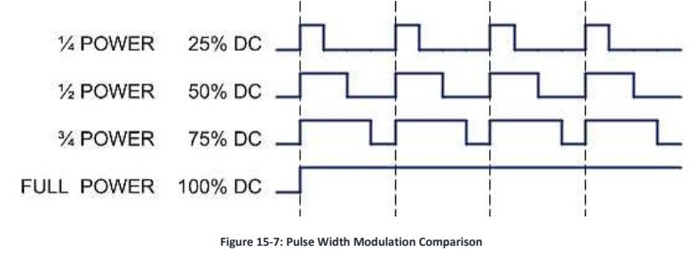  

## DC Motor Control With Optoisolator

- Separating the power supplies of the motor and logic wil reduce the possibility of damage to the control circuit.
- Protection of the control circuit is proovided by the optoisolator.
- The separation of power suplies also allows use of high-voltage motors.
- The decoupling capacitor across the motor helps to reduce the EMI created by the motord.

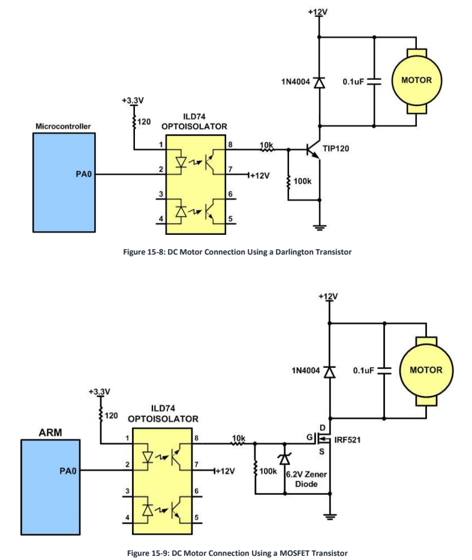  

## Programming PWM in STM32

In STM32 the PWM is incorporated into the Timer. 

### CR1 and TIM counting

1. Count UP (CMS=00 and DIR=0): TIMx_CNT counts up from 0 value until reaches the value of ARR.
2. Count DOWN (CMS=00 and DIR=1).
3. Count Up-Down (CMS= 01, 10 or 11): It counts up from 0 until it reaches ARR, DIR bit from CR1 is SET and in next clock it counts down to 0 and DIR bit is cleared.

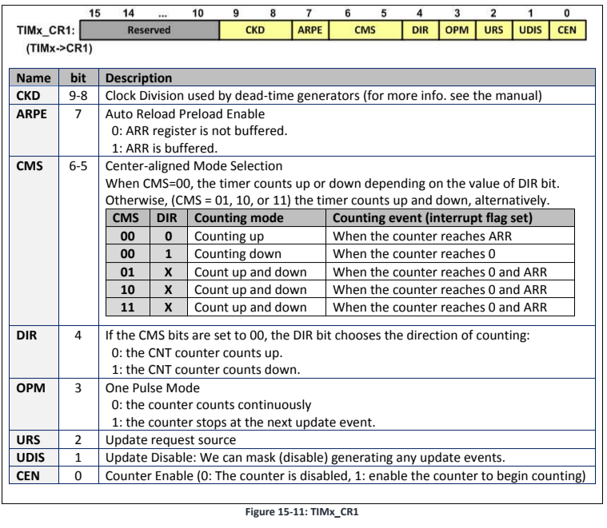  

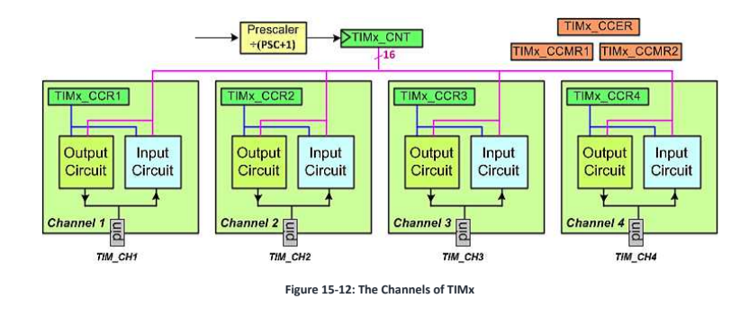  

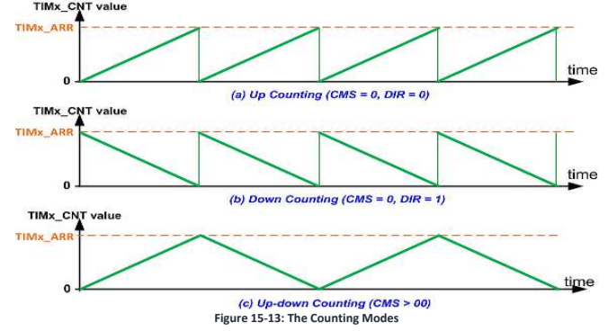  

The TIMx_CCMR (TimX Capture/compare Mode Register) bits are used to cconfigure wave generator. Same bits are used to choose PWM freatures.

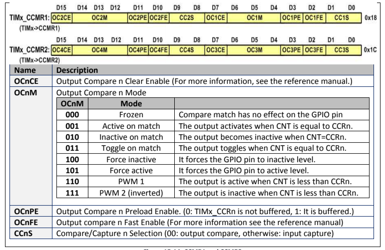  

### PWM in Counting-Up mode

- PWM1-mode (OCnM=110): When TIMx_CNT < TIMx_CCR -> PWM ACTIVE
  - Otherwise, inactive 
  - When TIMx_CCRn is bigger than TIMx_ARR the duty cycle is 100%
  - When TIMx_CCRn is 0 the duty cycle is 0%
- In PWM outputs are inverted.

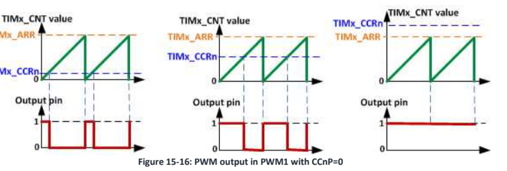  

### PWM Output duty cycle and frequency

#### Example 1

- OCnM = 110 (PWM1)
- TIMx_ARR = 8 
- TIMx_CCRn = 5 
- The output is set on couunter overflow (RELOAD) and its cleared on compare match
- CNT is reloaded with 0 after ARR+1 clocks and the output is set to HIGH for CCRn clocks

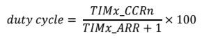  

- Frequency of the output is 1/(ARR+1) of the frequency of timer clock
  
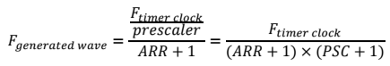  

#### Example 2

```
Frequency (F) and Duty Cicle (DC) of a PWM if:
- TIMx_ARR=999
- TIMx_CCRn=250
- Assume:
    - OCnM=110 (PWM1)
    - No prescaler
    - TIMx clk freq 72 MHz

F = (72.000.000) / (999+1) = 72 KHz = 72.000 Hz.
DC = (TIMx_CCR) / (TIMx_ARR + 1) * 100 = (250/1000) * 100 = 25 %
```

### Update Signal: Shadow Register and Preloading

- When wave gen is working, if we change values of TIMx_CCRn or TIMx_ARR the changes should be synchronized with the wave gen
- To prevent unacceptable waves, there are shadow registers.
- TIMx_ARR preloading -> enable using ARPE (Auto Reload PReloading Enable) bit of CR1.
- CCRn register preloading -> OCnPE bit for each CCRn iin the CCMRx.
- The registers will be loaded to the shadow registeraat the nd of genrating a wave cycle, when the ipdate singal is raised.
- When preloading is enabled, it is needed to generate an update signal BEFORE turingng on the timer, in orer to initialize the shadow register with the values of the registers. If the UG bit of TIMx_EGR is set an update signal is generated and then hardware clears the UG bit automatically.

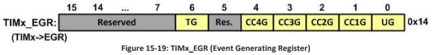  

```c
/* PRogram generates a PWM wave with duty cycle of 30% and frequency of 100Hz on TIM2_CH1 (PA0). You can use the oscilloscope to observe the waveform. */

#include <stm32f10x.h>

int main()
{
  RCC->APB2ENR |= 0xFC; /* enable GPIO clocks */
  RCC->APB1ENR |= (1<<0); /* enable TIM2 clock */
  GPIOA->CRL = 0x4444444B; /* PA0: Alternate func. output */

  TIM2->CCER = 0x1 << 0; /* CC1P = 0, CC1E= 1 */
  TIM2->CCMR1 = 0x0068; /* OC1M=PWM1, OCC1PE=1 */
  TIM2->CR1 = 0x80; /* Auto reload preload enable */

  TIM2->PSC = 720-1; /* prescaler = 720 */
  TIM2->ARR = 1000-1; /* ARR = 999 */
  TIM2->CCR1 = 1000; /* duty cycle = (300/1000)*100 */

  TIM2-> EGC = 1; /* UG = 1 (generate update) */
  TIM2-> CR1 = |= 0x01; /* timer enable (CEN=1) */

  while(1)
  {
  }
}

/* Program that generated wave changes gradually from 0% to 100%.  */
int main(){
  
  RCC->APB2ENR |= 0xFC; /* enable GPIO clocks */
  RCC->APB1ENR |= (1<<0); /* enable TIM2 clock */
  GPIOA->CRL = 0x4444444B; /* PA0: Alternate func. output */

  TIM2->CCER = 0x1 << 0; /* CC1P = 0, CC1E= 1 */
  TIM2->CCMR1 = 0x0068; /* OC1M=PWM1, OCC1PE=1 */
  TIM2->CR1 = 0x80; /* Auto reload preload enable */

  TIM2->PSC = 720-1; /* prescaler = 720 */
  TIM2->ARR = 1000-1; /* ARR = 999 */

  TIM2->EGR = 1; /* UG = 1 (generate update) */
  TIM2->CR1 |= 0x01 /* Timer Enable CEN = 1 */

  while(1)
  {
    /*change gradually the dc from 0 to 100% */
    for(uint16_t d = 0 ; d <= 1000 ; d+=20)
    {
      TIM2->CCR1 = d;
      delay_ms(50);
    }
  }
}
```

## DC Motor Control Using PWM

For driving motors it is preferrable to use center-alligned mode. DC Motors have smoother move when the freqeuency of the wave is thigher, but transistors have switching speed limits and if you swtich transistors faster, they heat more. 

### Center aligned mode

#### Up-Down Counting (Center Aligned Mode)

- if we set CMD bits in CR1 to any values other than 00, then the timer counts in up down counting mode and the output is Center-Aligned PWM.
- The counter will count up from 0- to TIMx_ARR reg the nturn arround and count to 0.

#### PWM Output Duty Cycle and Frequency

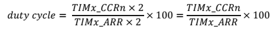  

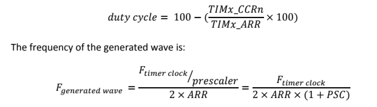  

```c
/* * * * * * * * * * * * * *
Using PWM1 mode, write a problem that makess a wave with frequency of 1 KHz and duty cycle of 70%

2 * ARR * (1+PSC) = Ftim_clk / Fgen_wave = 72M / 1k = 72.000 -> ARR * (1+PSC) = 36.000

we can choose many diffrerent values for ARR and PSC. We choose ARR = 3600 and NO prescaler.

DutyCycle / 100 = CCRn  / ARR = 70 / 100 = CCRn/36000 -> CCRn = 25.200

in the following program CH2  of TIM3 is used 

* * * * * * * * * * * * * * * */

int main()
{
  RCC->APB2ENR |= 0xFC; /* enable GPIO clocks */
  RCC->APB1ENR |= (1<<1); /* enable TIM3 clock */
  GPIOA->CRL = 0xB4444444; /* PA7: Alternate func. output */

  TIM2->CCER = 0x1 << 4; /* CC2P = 0, CC2E= 1 */
  TIM2->CCMR1 = 0x6800; /* OC2M=PWM1, OCC2PE=1 */
  TIM2->CR1 = 0xA0; /* Auto reload preload enable, UP-DOWN counting mode */

  TIM3->PSC = 0; /* prescaler = 1 */
  TIM3->ARR = 36000; /* ARR = 36.000*/
  TIM3->CCR2 = 25200; /* duty cycle = (25200/36000)*100 */

  TIM3->EGR = 1; /* UG = 1 (generate update) */
  TIM3->CR1 |= 0x01; /* timer enable (CEN = 1) */

  while(1){}
}
```
